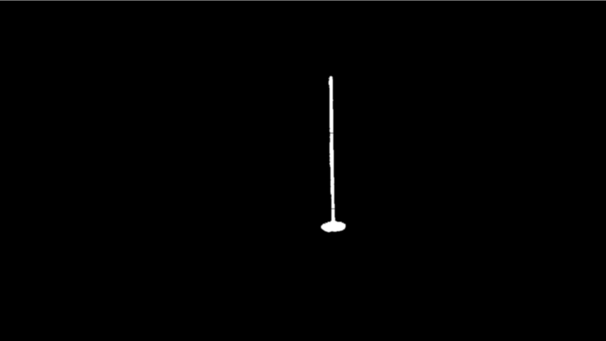
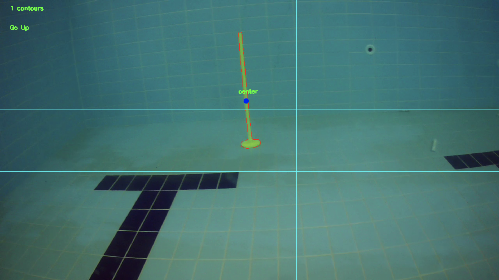

# ITUROV Teknofest Pinger Mission

This code is written for a mission in Teknofest 2021 Unmanned Underwater Technologies Contest, and also used in the same contest of Teknofest 2022, within
the ITUROV Team.

The objective of the mission is to detect the target with a Pinger on it, and destroy it (the AUV simply hits the target) using either an acoustic sensor,
or computer vision. I used the second option, obviously.

## The Algorithm
The algorithm is simple: After receiving the frame from the camera, the program masks the image with the values that I found by trial and error. After the masking,
the target (and the objects that have the same colour with the target) becomes white, and everything else becomes black. 

After the masking, the program
blurs the image then draws contours around the white area (the target). After this process, the center point of every point on the contour line, must be on
the target. 

 

After finding and marking the center point that we need, only thing left to do is to keep this center point in front of the AUV. If the AUV
goes straight to the center, it will hit eventually. To keep the AUV on the course to the target, I defined a central rectangle area on the frame, which is
240px X 160px centered on the middle point of the frame. If the center point of the target goes out of this rectangle, the main computer sends motion commands
to the engines of the AUV to return back on course.

Right after hitting the target, the mission is accomplished.

## Libraries

The OpenCV and NumPy libraries must be installed for this code to work.